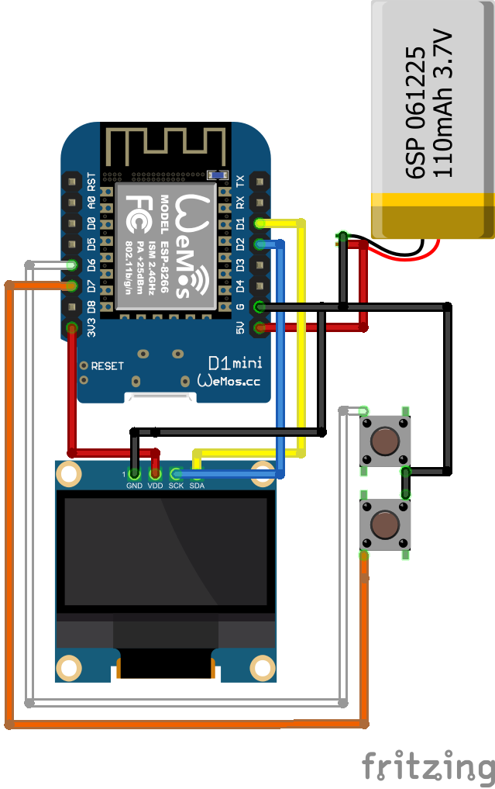

# MiniReader для ESP8266

Компактный электронный ридер на базе ESP8266 с OLED-дисплеем и веб-интерфейсом для загрузки и чтения текстовых файлов.

## Возможности

- 📖 Чтение текстовых файлов на OLED-дисплее 128x64
- 🌐 Веб-интерфейс для загрузки и управления файлами
- 📱 Адаптивный дизайн для мобильных устройств
- 🔄 Прокрутка текста кнопками с переменной скоростью
- 📝 Автоматический перенос длинных строк
- 🔤 Поддержка кириллицы (UTF-8)
- 💾 Хранение файлов в файловой системе SPIFFS
- 📊 Мониторинг использования памяти

## Компоненты

### Обязательные:
- ESP8266 (NodeMCU, Wemos D1 Mini или аналог)
- OLED-дисплей SSD1306 128x64 (I2C)
- 2 кнопки (тактовые)
- Соединительные провода

### Опциональные:
- Корпус для устройства
- Батарея для автономной работы

## Схема подключения

```
ESP8266 (NodeMCU)    OLED SSD1306
------------------   ------------
D1 (GPIO5)    -----> SDA
D2 (GPIO4)    -----> SCL
3V3           -----> VCC
GND           -----> GND

ESP8266              Кнопки
------------------   --------
D6 (GPIO12)   -----> Кнопка 1 (Прокрутка вверх)
D7 (GPIO13)   -----> Кнопка 2 (Прокрутка вниз)
GND           -----> Общий контакт кнопок
```



## Установка и настройка

### 1. Подготовка Arduino IDE

Установите необходимые библиотеки через менеджер библиотек:
- `ESP8266WiFi` (встроенная)
- `ESP8266WebServer` (встроенная)
- `U8g2` от oliver
- `Wire` (встроенная)

### 2. Настройка WiFi

В коде измените параметры подключения:
```cpp
const char* ssid = "ВАШ_SSID";
const char* password = "ВАШ_ПАРОЛЬ";
```

### 3. Загрузка прошивки

1. Подключите ESP8266 к компьютеру
2. Выберите правильную плату и порт в Arduino IDE
3. Загрузите код на устройство

### 4. Первый запуск

После загрузки прошивки:
1. Устройство подключится к WiFi
2. На дисплее отобразится IP-адрес
3. Откройте браузер и перейдите по указанному IP-адресу

## Использование

### Веб-интерфейс

1. **Главная страница** - общая информация и статистика
2. **Список файлов** - просмотр загруженных файлов
3. **Загрузка файлов** - добавление новых текстовых файлов

### Управление на устройстве

- **Кнопка 1 (D6)** - прокрутка текста вверх
- **Кнопка 2 (D7)** - прокрутка текста вниз
- **Удержание кнопки** - ускорение прокрутки (до 5x)

### Поддерживаемые форматы

- Текстовые файлы (.txt)
- Кодировка UTF-8
- Автоматический перенос строк
- Максимум 42 символа в строке

## Технические характеристики

- **Дисплей**: 128x64 пикселя, 6 строк текста
- **Память**: зависит от модели ESP8266
- **WiFi**: 802.11 b/g/n
- **Файловая система**: SPIFFS
- **Шрифт**: 5x8 пикселей с поддержкой кириллицы

## Структура проекта

```
MiniReader/
├── MiniReader.ino          # Основной код
├── README.md              # Этот файл
├── MiniReaderScheme.png  # Схема подключения
└── examples/              # Примеры текстовых файлов
    ├── test.txt
    ├── sample.txt
    ├── poetry.txt 
    ├── manual.txt
    └── science.txt
```

## Возможные улучшения

- [ ] Добавление закладок
- [ ] Поддержка других форматов (HTML, Markdown)
- [ ] Настройка размера шрифта
- [ ] Темная/светлая тема
- [ ] Поиск по тексту
- [ ] Автоматическая прокрутка
- [ ] Сохранение позиции чтения
- [ ] Поддержка папок

## Устранение неполадок

### Проблемы с подключением WiFi
- Проверьте правильность SSID и пароля
- Убедитесь, что ESP8266 находится в зоне покрытия
- Проверьте поддержку 2.4GHz сети

### Проблемы с дисплеем
- Проверьте подключение I2C (SDA/SCL)
- Убедитесь в правильности адреса дисплея
- Проверьте питание дисплея (3.3V)

### Проблемы с файлами
- Используйте кодировку UTF-8
- Проверьте размер файла (ограничение SPIFFS)
- Убедитесь в корректности имени файла

## Автор

Проект создан для изучения возможностей ESP8266 и создания простого устройства для чтения текстов.

## Лицензия

Проект распространяется под лицензией MIT. Вы можете свободно использовать, изменять и распространять код.

---

**Примечание**: Для корректной работы с кириллицей убедитесь, что текстовые файлы сохранены в кодировке UTF-8.